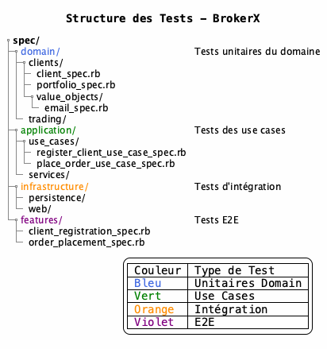

# Vue Développement - 4+1 Views

## Objectif
Décrire l'organisation du code source, des modules, et des dépendances de développement.

## Structure des Modules

### Architecture Hexagonale Implémentée


### Dépendances entre Modules


### Configuration des Dépendances (Gemfile)
```ruby
# Core
gem 'rails', '~> 7.0.0'
gem 'pg', '~> 1.1'
gem 'puma', '~> 5.0'

# API
gem 'rack-cors'
gem 'jwt'

# Testing
gem 'rspec-rails'
gem 'factory_bot_rails'
gem 'faker'
gem 'shoulda-matchers'

# Development
gem 'annotate'

# Monitoring (Phase 2)
gem 'lograge'
```
### Conventions de Développement

#### Structure des Tests



#### Règles de Dépendances
1. Domain : Aucune dépendance externe (pure Ruby)

2. Application : Peut dépendre de Domain uniquement

3. Infrastructure : Peut dépendre de Application et Domain

4. Interdiction : Domain ne peut pas dépendre d'Application ou Infrastructure

#### Outils de Développement
- **DE** : VS Code avec extensions Ruby/Rails

- **Debugging** : byebug, pry-rails

- **Qualité** : brakeman (optionnel : reek)

- **Documentation** : yard, plantuml