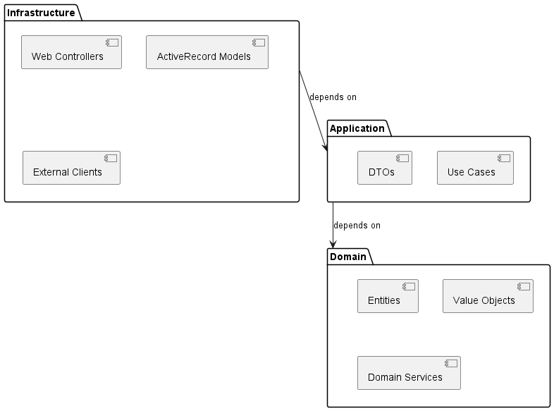

# Vue Développement - 4+1 Views

## Objectif
Décrire l'organisation du code source, des modules, et des dépendances de développement.

## Structure des Modules

### Architecture Hexagonale Implémentée
```
brokerx/
├── app/
│ ├── domain/ # Couche Domaine (Pure Ruby)
│ │ ├── clients/ # BC Client & Comptes
│ │ │ ├── entities/
│ │ │ │ ├── client.rb
│ │ │ │ ├── account.rb
│ │ │ │ └── portfolio.rb
│ │ │ ├── value_objects/
│ │ │ │ ├── email.rb
│ │ │ │ ├── money.rb
│ │ │ │ └── account_status.rb
│ │ │ ├── services/
│ │ │ │ └── portfolio_management_service.rb
│ │ │ └── repositories/ # Interfaces seulement
│ │ │ ├── client_repository.rb
│ │ │ └── portfolio_repository.rb
│ │ ├── trading/ # BC Ordres & Trading
│ │ └── market_data/ # BC Marché & Données
│ ├── application/ # Couche Application
│ │ ├── use_cases/
│ │ │ ├── register_client_use_case.rb
│ │ │ ├── authenticate_user_use_case.rb
│ │ │ └── place_order_use_case.rb
│ │ ├── dtos/ # Data Transfer Objects
│ │ │ ├── client_registration_dto.rb
│ │ │ └── place_order_dto.rb
│ │ └── services/
│ │ └── order_validation_service.rb
│ └── infrastructure/ # Couche Infrastructure
│ ├── web/ # Adaptateurs Web
│ │ ├── controllers/
│ │ │ ├── clients_controller.rb
│ │ │ ├── orders_controller.rb
│ │ │ └── authentication_controller.rb
│ │ ├── serializers/
│ │ │ ├── client_serializer.rb
│ │ │ └── order_serializer.rb
│ │ └── middleware/
│ │ └── authentication_middleware.rb
│ ├── persistence/ # Adaptateurs Persistance
│ │ ├── active_record/
│ │ │ ├── client_record.rb
│ │ │ ├── order_record.rb
│ │ │ └── portfolio_record.rb
│ │ └── repositories/
│ │ ├── active_record_client_repository.rb
│ │ ├── active_record_order_repository.rb
│ │ └── active_record_portfolio_repository.rb
│ └── external/ # Adaptateurs Externes
│ ├── market_data_client.rb
│ └── email_sender.rb
├── config/ # Configuration
│ ├── application.rb
│ ├── database.yml
│ └── routes.rb
├── db/ # Migrations
│ ├── migrate/
│ └── seeds.rb
└── spec/ # Tests
├── domain/
├── application/
├── infrastructure/
└── features/
```


### Dépendances entre Modules



### Configuration des Dépendances (Gemfile)
```ruby
# Core
gem 'rails', '~> 7.0.0'
gem 'pg', '~> 1.1'
gem 'puma', '~> 5.0'

# API
gem 'rack-cors'
gem 'jwt'

# Testing
gem 'rspec-rails'
gem 'factory_bot_rails'
gem 'faker'
gem 'shoulda-matchers'

# Development
gem 'rubocop', require: false
gem 'annotate'

# Monitoring (Phase 2)
gem 'lograge'
```
### Conventions de Développement

#### Structure des Tests
```
spec/
├── domain/  -> Tests unitaires du domaine
│   ├── clients/
│   │   ├── client_spec.rb
│   │   ├── portfolio_spec.rb
│   │   └── value_objects/email_spec.rb
│   └── trading/
├── application/ -> Tests des use cases
│   ├── use_cases/
│   │   ├── register_client_use_case_spec.rb
│   │   └── place_order_use_case_spec.rb
│   └── services/
├── infrastructure/ ->  Tests d'intégration
│   ├── persistence/
│   └── web/
└── features/  -> Tests E2E
    ├── client_registration_spec.rb
    └── order_placement_spec.rb
```

#### Règles de Dépendances
1. Domain : Aucune dépendance externe (pure Ruby)

2. Application : Peut dépendre de Domain uniquement

3. Infrastructure : Peut dépendre de Application et Domain

4. Interdiction : Domain ne peut pas dépendre d'Application ou Infrastructure

#### Outils de Développement
- **DE** : VS Code avec extensions Ruby/Rails

- **Debugging** : byebug, pry-rails

- **Quality** : rubocop, reek, brakeman

- **Documentation** : yard, plantuml