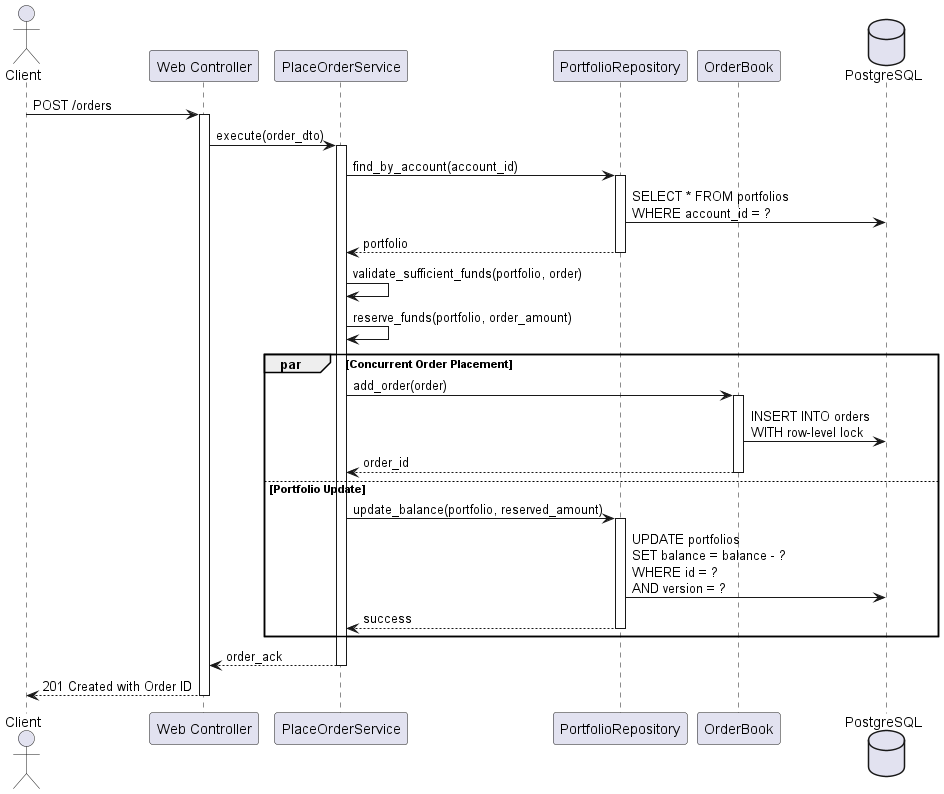

# Vue Processus (Concurrency) - 4+1 Views

## Objectif
Décrire le parallélisme, la concurrence, et les interactions entre processus.

## Scénarios de Concurrence Critiques

### 1. Placement d'Ordre avec Validation Concurrence
 

### 2. Appariement d'Ordres en Temps Réel


## Stratégies de Concurrence

### Gestion des Accès Concurrents aux Portefeuilles

```ruby
class PortfolioRepository
  def reserve_funds(portfolio_id, amount)
    ActiveRecord::Base.transaction do
      # Verrouillage pessimiste pour éviter race conditions
      portfolio = PortfolioRecord.lock.find(portfolio_id)
      
      if portfolio.balance >= amount
        portfolio.balance -= amount
        portfolio.reserved_balance += amount
        portfolio.save!
        true
      else
        false
      end
    end
  end
end
```

### Architecture Événementielle (Préparation Phase 3)


## Configuration des Workers

```ruby
# config/sidekiq.yml (Phase 2)
:concurrency: 5
:queues:
  - critical
  - default
  - low

# Workers spécialisés
class OrderMatchingWorker
  include Sidekiq::Worker
  sidekiq_options queue: :critical, retry: 3
  
  def perform(order_id)
    # Logique d'appariement
  end
end
```

## Considérations de Performance
### Objectifs Phase 1 (Monolithique)

- **Latence ordre** → ACK : ≤ 500 ms

- **Débit** : ≥ 300 ordres/seconde

- **Connexions concurrentes** : 100+ clients simultanés

### Stratégies d'Optimisation
- **Connection pooling** : Configuration PostgreSQL

- **Caching** : Redis pour les données marché (Phase 2)

- **Background processing**: Sidekiq pour les tâches lourdes

- **Database indexing** : Index sur les colonnes de recherche critiques

## Gestion des Erreurs en Concurrence
```ruby
class PlaceOrderService
  def execute(command)
    retries = 0
    begin
      ActiveRecord::Base.transaction do
        # Logique métier avec gestion concurrence
      end
    rescue ActiveRecord::StaleObjectError
      retries += 1
      retry if retries < 3
      raise ConcurrencyError.new("Too many retries")
    end
  end
end
```


