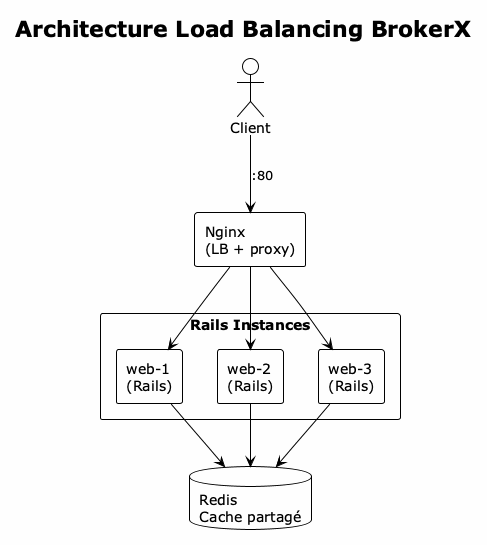

# ADR 009: Load Balancing avec Nginx

## Statut
**Approuvé** | **Date**: 2025-11-25 | **Décideurs**: Équipe Architecture

## Contexte
Pour assurer la haute disponibilité et la scalabilité horizontale de BrokerX, nous avons besoin d'un mécanisme de load balancing qui distribue le trafic entre plusieurs instances de l'application.

## Décision
**Nous implémentons un load balancer Nginx avec 3 instances Rails répliquées.**

### Architecture implémentée :



### Configuration Nginx :

```nginx
upstream brokerx_app {
    least_conn;  # Distribution par connexions actives
    server web-1:3000 weight=1;
    server web-2:3000 weight=1;
    server web-3:3000 weight=1;
    keepalive 32;
}

location / {
    proxy_pass http://brokerx_app;
    proxy_set_header X-Real-IP $remote_addr;
    add_header X-Upstream-Server $upstream_addr always;
}

# WebSocket support pour ActionCable
location /cable {
    proxy_pass http://brokerx_app;
    proxy_http_version 1.1;
    proxy_set_header Upgrade $http_upgrade;
    proxy_set_header Connection "upgrade";
}
```

### Fichier docker-compose.lb.yml :
- Service `nginx` : Load balancer sur port 80
- Services `web-1`, `web-2`, `web-3` : Instances Rails
- Service `redis` : Cache partagé
- Service `postgres` : Base de données

## Conséquences

### Positives
- **Haute disponibilité** : Si une instance tombe, les autres continuent
- **Scalabilité horizontale** : Ajout facile d'instances
- **Répartition de charge** : Distribution équitable du trafic
- **Zero-downtime deployment** : Possible avec rolling updates

### Négatives (mitigées)
- Complexité opérationnelle accrue → mitigée par docker-compose
- Gestion des sessions → résolue par Redis partagé
- Healthchecks nécessaires → implémentés dans docker-compose

## Métriques de validation

Tests k6 avec 15 VUs pendant 30s :

| Instance | Hits | Distribution |
|----------|------|--------------|
| web-1 | 1,213 | ~32% |
| web-2 | 1,270 | ~33% |
| web-3 | 1,310 | ~35% |

**Résultats** : Distribution quasi-parfaite (~33% par instance)

## Alternatives considérées

### HAProxy
- **Avantages** : Très performant, riche en fonctionnalités
- **Inconvénients** : Configuration plus complexe

### Traefik
- **Avantages** : Configuration dynamique, intégration Docker native
- **Inconvénients** : Overhead plus important

### Kong (déjà utilisé pour API Gateway)
- **Avantages** : Déjà en place pour le routing microservices
- **Inconvénients** : Plus orienté API Gateway que LB simple

## Utilisation

```bash
# Démarrer avec load balancing
docker compose -f docker-compose.lb.yml up -d

# Vérifier la distribution
for i in {1..6}; do 
  curl -s -I http://localhost/health | grep X-Upstream
done

# Test de charge
k6 run load/k6/lb_test.js
```

## Validation
- [x] Configuration nginx/nginx.conf
- [x] docker-compose.lb.yml avec 3 instances
- [x] Support WebSocket pour ActionCable
- [x] Test de distribution avec k6 (32-35% par instance)
- [x] Headers de debug (X-Upstream-Server, X-Instance)
