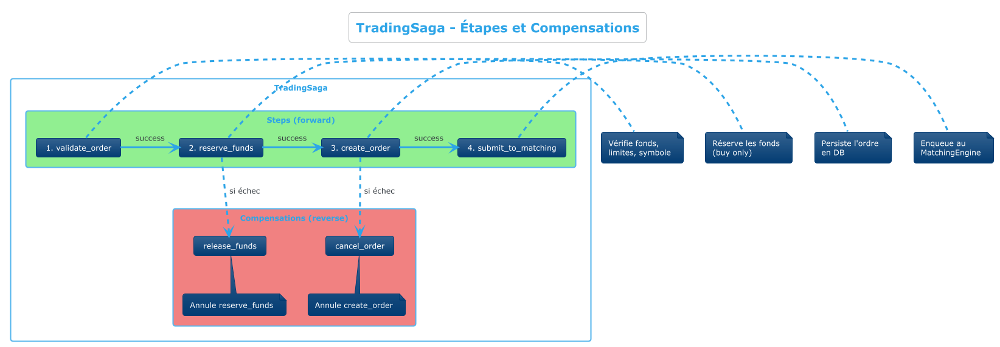

# ADR 010: Saga Pattern pour l'Orchestration des Transactions Distribuées

## Statut
**Approuvé** | **Date**: 2025-11-25 | **Décideurs**: Équipe Architecture

## Contexte
Le processus de trading dans BrokerX implique plusieurs étapes transactionnelles :
1. Validation de l'ordre
2. Réservation des fonds
3. Création de l'ordre
4. Soumission au moteur de matching

En cas d'échec à n'importe quelle étape, nous devons pouvoir annuler (compenser) les étapes précédentes pour maintenir la cohérence du système.

## Décision
**Nous implémentons le Saga Pattern avec compensation pour orchestrer les transactions de trading.**

### Architecture du TradingSaga :



### Implémentation :

```ruby
# app/application/services/trading_saga.rb
class TradingSaga
  STEPS = %i[validate_order reserve_funds create_order submit_to_matching]

  def execute(dto:, client_id:, correlation_id: nil)
    STEPS.each do |step|
      result = execute_step(step)
      unless result.success
        compensate!  # Annule les étapes précédentes
        return SagaResult.new(success: false, compensated: true)
      end
      @steps_completed << step
    end
    SagaResult.new(success: true, order_id: @context[:order].id)
  end

  def compensate!
    @compensation_log.reverse.each do |compensation|
      send("compensate_#{compensation[:step]}", compensation)
    end
  end
end
```

### Événements émis :

| Événement | Description |
|-----------|-------------|
| `saga.started` | Début de la saga |
| `saga.step.completed` | Étape terminée avec succès |
| `saga.step.failed` | Étape échouée |
| `saga.compensating` | Compensation en cours |
| `saga.completed` | Saga terminée avec succès |
| `saga.failed` | Saga échouée (après compensation) |

## Conséquences

### Positives
- **Cohérence garantie** : Les données restent cohérentes même en cas d'échec
- **Traçabilité** : Chaque étape est loggée et auditable
- **Observabilité** : Métriques Prometheus pour chaque saga
- **Extensibilité** : Facile d'ajouter de nouvelles étapes

### Négatives (mitigées)
- Complexité accrue → mitigée par une structure claire
- Performance (légère overhead) → négligeable (<5ms)
- Compensation partielle possible → logs d'audit pour réconciliation

## Métriques exposées

```ruby
# Compteurs Prometheus
saga_started_total
saga_completed_total{status="success|failed"}
saga_compensations_total
saga_steps_total{step="...", status="completed|failed"}
```

## Tests

```ruby
# test/unit/trading_saga_test.rb
test 'successful saga execution for buy order' do
  saga = TradingSaga.new(...)
  result = saga.execute(dto: buy_order_dto, client_id: client.id)
  
  assert result.success
  assert_equal 4, result.steps_completed.size
  assert_not result.compensated
end

test 'saga compensates on order creation failure' do
  saga = TradingSaga.new(order_repo: failing_repo, ...)
  result = saga.execute(dto: buy_order_dto, client_id: client.id)
  
  assert_not result.success
  assert result.compensated
  # Funds should be released after compensation
  assert_equal original_balance, portfolio.available_balance
end
```

## Alternatives considérées

### Two-Phase Commit (2PC)
- **Avantages** : Garantie ACID forte
- **Inconvénients** : Bloquant, ne scale pas, point de défaillance unique

### Event Sourcing complet
- **Avantages** : Historique complet, reconstruction possible
- **Inconvénients** : Complexité majeure, changement de paradigme

### Transactions distribuées (XA)
- **Avantages** : Standard industrie
- **Inconvénients** : Overhead important, dépendances complexes

## Validation
- [x] Implémentation TradingSaga avec 4 étapes
- [x] Compensation automatique en cas d'échec
- [x] Événements saga.* dans l'outbox
- [x] Tests unitaires (6 tests, tous passent)
- [x] Support correlation_id pour traçabilité
- [x] Métriques Prometheus
