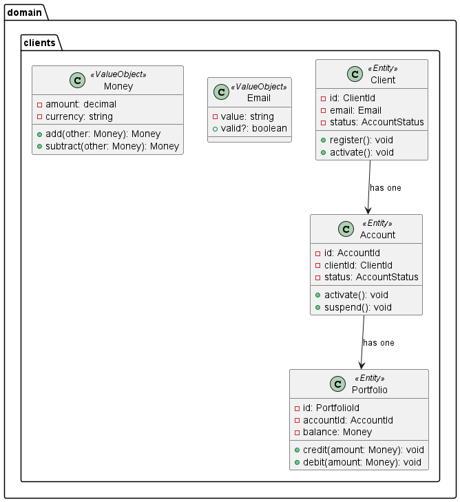

# BrokerX+ — Documentation Arc42 (v1)

Ce document suit la structure Arc42 (sections 1 à 12) et référence la documentation existante (4+1, plan Phase 2, dépôts de code) sans duplication inutile. Les sections intègrent des liens vers les artefacts pertinents, des images et des extraits de code issus du dépôt.

---

## 1. Introduction & Objectifs
- But: Plateforme de courtage en ligne pour investisseurs particuliers.
- Objectifs Phase 2:
  - Exposer une API RESTful sécurisée (CORS, Basic/JWT) et documentée (OpenAPI/Swagger)
  - Industrialiser l’observabilité (Prometheus/Grafana) et la performance (tests de charge)
  - Évoluer vers des microservices derrière une API Gateway (Kong/KrakenD)
  - Respecter les NFR (latence P95, throughput, disponibilité), conformité et audit
- Références:
  - Phase 1 — Synthèse: `docs/phase1_summary.md`
  - Phase 2 — Plan: `docs/phase2/plan.md`
  - 4+1 Views: `docs/architecture/4plus1_views/`

Illustration (4+1 — scénario clé de runtime):


## 2. Contraintes
- Techniques:
  - Monolithe Rails 7.x (Ruby), ActiveRecord, PostgreSQL
  - DDD (Domain, Application, Infrastructure) et pattern Repository
  - Conteneurisation (Docker/Compose), OS cible: Linux/VM
- Sécurité/Conformité:
  - JWT, MFA; logs auditables; conservation minimale des PII
  - CORS restreint; TLS/HTTPS (reverse proxy)
- Organisationnelles:
  - Traçabilité (Arc42, 4+1), ADR ≥3, runbook

## 3. Contexte & Périmètre
- Périmètre fonctionnel prioritaire (UC Must):
  - Comptes & Clients, Portefeuilles, Ordres & Matching, Données de marché
- Systèmes externes & interfaces:
  - Passerelles email (MFA), fournisseurs de données de marché (futur), API Gateway (Phase 2)
- Points d’entrée:
  - API REST `/api/v1` (auth, clients, portefeuilles, ordres)

Schéma ER (extrait):


## 4. Stratégie de solution
- Style architectural: Monolithe évolutif (Phase 1) → REST → Microservices (Phase 2)
- Séparation stricte Domain ↔ Application ↔ Infrastructure; Repositories pour découpler la persistance
- Sécurité: JWT + MFA (prototype), CORS, normalisation des erreurs JSON (RFC 7807-like)
- Observabilité: logs JSON corrélés (request_id), métriques Prometheus, dashboards Grafana (4 Golden Signals)
- Performance: LB via NGINX/Traefik, cache (mémoire/Redis) pour endpoints coûteux, tests de charge (k6/JMeter)

Extrait de configuration d’orchestration (docker-compose) simplifié:

```yaml

{{# from: docker-compose.yml #}}
# docker-compose.yml (extrait)
version: '3.8'
services:
  postgres:
    image: postgres:15-alpine
    environment:
      POSTGRES_DB: brokerx_development
      POSTGRES_USER: brokerx
      POSTGRES_PASSWORD: password
    ports:
      - "5432:5432"
  web:
    build: .
    ports:
      - "3000:3000"
    environment:
      DATABASE_HOST: postgres
      DATABASE_USERNAME: brokerx
      DATABASE_PASSWORD: password
      RAILS_ENV: development
    depends_on:
      postgres:
        condition: service_healthy

```

## 5. Vue Building Block (structure)
- Domain
  - Entities: `Client`, `Portfolio`
  - Value Objects: `Email`, `Money`
  - Repositories (interfaces): `ClientRepository`, `PortfolioRepository`
- Application
  - Use Cases: `AuthenticateUserUseCase`, `RegisterClientUseCase`
  - Services: `OrderValidationService`, `MatchingEngine` (ébauche)
- Infrastructure
  - ActiveRecord models: `ClientRecord`, `PortfolioRecord`
  - Repositories concrets: `ActiveRecordClientRepository`, `ActiveRecordPortfolioRepository`
  - Web adapters: controllers API v1 (`AuthenticationController`, `OrdersController`)
- Documentation & Artefacts
  - Repository Pattern: `docs/persistance/repository_pattern.md`
  - ERD (PUML): `docs/persistance/diagramme_entity-relation.puml`

Illustrations complémentaires (4+1 — vues de structure et de dépendances):





Extraits de code — Contrats de repository (domaine):

```ruby
# app/domain/clients/repositories/client_repository.rb (extrait)
module Domain
  module Clients
    module Repositories
      class ClientRepository < Domain::Shared::Repository::BaseRepository
        def find_by_email(email); raise NotImplementedError; end
        def find_by_verification_token(token); raise NotImplementedError; end
      end
    end
  end
end
```

```ruby
# app/domain/clients/repositories/portfolio_repository.rb (extrait)
module Domain
  module Clients
    module Repositories
      class PortfolioRepository < Domain::Shared::Repository::BaseRepository
        def find_by_account_id(account_id); raise NotImplementedError; end
        def reserve_funds(portfolio_id, amount); raise NotImplementedError; end
      end
    end
  end
end
```

## 6. Vue Runtime (scénarios)
- Authentification MFA + JWT (login → verify_mfa → token)
- Inscription client + création portefeuille
- Placement d’ordre avec réservation de fonds (diagramme séquence):
  - `docs/architecture/4plus1_views/puml/placement_ordre_w_validation.puml`

Vue séquence (image):


## 7. Vue Déploiement
- Cible initiale: Docker Compose (app Rails, PostgreSQL)
- Observabilité: Prometheus + Grafana en services Compose (Phase 2)
- Front LB: NGINX/Traefik (Phase 2), scale 1→N instances
- Gateway: Kong/KrakenD pour publication des microservices (Phase 2)

Snippet — Healthcheck web (compose):

```yaml
web:
  healthcheck:
    test: ["CMD", "curl", "-f", "http://localhost:3000/health"]
    interval: 30s
    timeout: 10s
    retries: 3
```

## 8. Concepts transverses
- Sécurité: JWT, MFA, CORS, validation/assainissement entrées
- Persistance: transactions, idempotency-key pour dépôts/ordres (Phase 2), audit append-only
- Observabilité: logs JSON, corrélation (request_id), métriques `/metrics`
- Résilience & performance: LB, cache Redis, tolérance aux pannes, backpressure (à évaluer)

Extrait — Repository AR avec transaction & lock:

```ruby
# app/infrastructure/persistence/repositories/active_record_portfolio_repository.rb (extrait)
def reserve_funds(portfolio_id, amount)
  ::ActiveRecord::Base.transaction do
    record = Infrastructure::Persistence::ActiveRecord::PortfolioRecord.lock.find_by(id: portfolio_id)
    raise Domain::Shared::Repository::RecordNotFound unless record
    if record.available_balance >= amount
      record.available_balance -= amount
      record.reserved_balance += amount
      record.save!
    else
      raise Domain::Shared::Repository::Error, "Insufficient funds"
    end
  end
end
```

## 9. Décisions architecturales (ADRs)
- Les ADRs seront consolidés sous `docs/architecture/adr/` (≥ 3 attendus):
  - Style architectural (Monolithe → REST → Microservices + Gateway)
  - Persistance & transactions (ORM/AR, Repositories, idempotency)
  - Stratégie d’erreurs & versionnage d’API
  - Conformité & audit (journal append-only, traces)

  Format cible pour ADRs (exemple d’entête):

  ```markdown
  # ADR-0001: Style architectural (Monolithe → REST → Microservices + Gateway)
  Status: Proposed | Accepted | Superseded
  Date: 2025-09-28
  Contexte, Décision, Conséquences, Alternatives
  ```

## 10. Exigences qualité
- 4 Golden Signals:
  - Latence P95/P99; Trafic (RPS); Erreurs 4xx/5xx; Saturation (CPU/RAM/threads)
- Cibles indicatives (Phase 2):
  - Auth P95 < 200 ms; Market Data P95 < 120 ms; Place Order P95 < 300 ms
  - Erreurs 5xx < 1%; CPU < 75% P95
- Sécurité: tokens TTL/rotation, CORS strict, validation stricte des entrées

Tableau d’objectifs (exemple minimal):

```text
P95 Auth < 200 ms | P95 Order < 300 ms | 5xx < 1% | CPU P95 < 75%
```

## 11. Risques & Dette technique
- Double définition AR (`ClientRecord`) → "superclass mismatch" (corriger en supprimant le doublon)
- Absence de vérification de mot de passe (prototype) → durcir auth
- Tests & couverture limités → ajouter tests repo/e2e + SimpleCov
- Observabilité incomplète → mettre en place Prometheus/Grafana au plus tôt
- Migration microservices: complexité de découpage, cohérence transactionnelle, données partagées

Lien vers suivi des dettes: `docs/phase2/plan.md` (sections Observabilité & Microservices)

## 12. Glossaire
- MFA: Multi-Factor Authentication
- JWT: JSON Web Token
- DDD: Domain-Driven Design
- Repository Pattern: abstraction de la persistance via interfaces domaine et implémentations infra
- 4 Golden Signals: latence, trafic, erreurs, saturation

Voir aussi: `docs/phase2/plan.md` (Mesures et seuils)

Glossaire du domaine complet:

- `docs/Domain-Driven-Design/domain_glossary.md`

---

## Annexes (références sans duplication)
- 4+1 Views (mis à jour): `docs/architecture/4plus1_views/`
- Plan Phase 2: `docs/phase2/plan.md`
- Synthèse Phase 1: `docs/phase1_summary.md`
- ADRs (à créer/compléter): `docs/architecture/adr/`
- Runbook (guide d’exploitation) — à créer: `docs/operations/runbook.md` (procédures: démarrage/arrêt, santé, logs, metrics, pannes)
