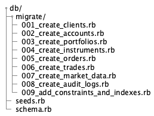

# Conception du Schéma de Base de Données

## Overview
Schéma PostgreSQL conçu pour supporter les 3 bounded contexts avec intégrité référentielle, contraintes métier et préparation pour l'évolutivité.

## Diagramme Entité-Relation


## Contraintes d'Intégrité Métier
### Contraintes PostgreSQL
```sql
-- Clients
ALTER TABLE clients ADD CONSTRAINT clients_email_unique UNIQUE (email);
ALTER TABLE clients ADD CONSTRAINT clients_status_check 
    CHECK (status IN ('pending', 'active', 'suspended', 'rejected'));

-- Portfolios
ALTER TABLE portfolios ADD CONSTRAINT portfolios_balance_non_negative 
    CHECK (available_balance >= 0 AND reserved_balance >= 0);

-- Orders
ALTER TABLE orders ADD CONSTRAINT orders_quantity_positive 
    CHECK (quantity > 0);
ALTER TABLE orders ADD CONSTRAINT orders_filled_quantity_valid 
    CHECK (filled_quantity <= quantity AND filled_quantity >= 0);
ALTER TABLE orders ADD CONSTRAINT orders_remaining_quantity_valid 
    CHECK (remaining_quantity = quantity - filled_quantity);
ALTER TABLE orders ADD CONSTRAINT orders_status_valid 
    CHECK (status IN ('new', 'working', 'partially_filled', 'filled', 'cancelled', 'rejected'));
ALTER TABLE orders ADD CONSTRAINT orders_market_price_null 
    CHECK (type != 'market' OR limit_price IS NULL);

-- Trades
ALTER TABLE trades ADD CONSTRAINT trades_quantity_positive 
    CHECK (quantity > 0);
ALTER TABLE trades ADD CONSTRAINT trades_price_positive 
    CHECK (price > 0);
```
### Indexes de Performance
```sql
-- Indexes pour les recherches fréquentes
CREATE INDEX idx_clients_email ON clients(email);
CREATE INDEX idx_clients_status ON clients(status);
CREATE INDEX idx_orders_account_status ON orders(account_id, status);
CREATE INDEX idx_orders_instrument_status ON orders(instrument_id, status);
CREATE INDEX idx_orders_created_at ON orders(created_at);
CREATE INDEX idx_trades_instrument_time ON trades(instrument_id, trade_time);
CREATE INDEX idx_market_data_instrument_timestamp ON market_data(instrument_id, timestamp);

-- Indexes pour l'unicité et les contraintes
CREATE UNIQUE INDEX idx_instruments_symbol ON instruments(symbol) WHERE status = 'active';
CREATE UNIQUE INDEX idx_orders_client_order_id ON orders(client_order_id) WHERE client_order_id IS NOT NULL;
```

## Stratégie de Migration
### Structure des Migrations Rails



## Données de Référence (Seeds)
### Instruments Financiers de Base
```ruby
# db/seeds.rb
instruments = [
  { symbol: 'AAPL', name: 'Apple Inc.', currency: 'USD', type: 'stock', 
    min_price: 1.00, max_price: 1000.00, tick_size: 0.01, lot_size: 1, status: 'active' },
  { symbol: 'MSFT', name: 'Microsoft Corporation', currency: 'USD', type: 'stock',
    min_price: 1.00, max_price: 1000.00, tick_size: 0.01, lot_size: 1, status: 'active' },
  { symbol: 'GOOGL', name: 'Alphabet Inc.', currency: 'USD', type: 'stock',
    min_price: 1.00, max_price: 5000.00, tick_size: 0.01, lot_size: 1, status: 'active' }
]

instruments.each do |instrument_data|
  Instrument.find_or_create_by(symbol: instrument_data[:symbol]) do |instrument|
    instrument.assign_attributes(instrument_data)
  end
end

# Compte de démonstration
demo_client = Client.find_or_create_by(email: 'demo@brokerx.com') do |client|
  client.first_name = 'Demo'
  client.last_name = 'User'
  client.date_of_birth = Date.new(1990, 1, 1)
  client.status = 'active'
  client.verified_at = Time.current
end

demo_account = Account.find_or_create_by(client: demo_client) do |account|
  account.account_number = "DEMO#{Time.now.to_i}"
  account.type = 'individual'
  account.status = 'active'
end

demo_portfolio = Portfolio.find_or_create_by(account: demo_account) do |portfolio|
  portfolio.currency = 'USD'
  portfolio.available_balance = 100000.00
  portfolio.reserved_balance = 0.00
end
```
## Stratégie de Sauvegarde et Récupération
### Script de Sauvegarde
```bash
#!/bin/bash
# scripts/backup.sh

BACKUP_DIR="/backups/brokerx"
DATE=$(date +%Y%m%d_%H%M%S)

# Sauvegarde PostgreSQL
pg_dump -h localhost -U brokerx_user brokerx_prod > $BACKUP_DIR/brokerx_$DATE.sql

# Compression
gzip $BACKUP_DIR/brokerx_$DATE.sql

# Conservation 7 jours
find $BACKUP_DIR -name "*.gz" -mtime +7 -delete
```

## Performance et Optimisation
### Configuration PostgreSQL
```sql
-- postgresql.conf optimizations
shared_buffers = '1GB'
effective_cache_size = '3GB'
work_mem = '50MB'
maintenance_work_mem = '256MB'
random_page_cost = 1.1
effective_io_concurrency = 200

-- Pour le trading (beaucoup d'écritures)
wal_buffers = '16MB'
checkpoint_timeout = '15min'
max_wal_size = '2GB'
```

### Monitoring des Performances
```sql
-- Requêtes lentes
SELECT query, mean_time, calls 
FROM pg_stat_statements 
ORDER BY mean_time DESC 
LIMIT 10;

-- Index non utilisés
SELECT schemaname, tablename, indexname, idx_scan, idx_tup_read, idx_tup_fetch
FROM pg_stat_user_indexes 
WHERE idx_scan = 0;
```
Cette conception de schéma respecte les principes DDD avec une séparation claire des bounded contexts tout en maintenant l'intégrité référentielle et les performances nécessaires pour une plateforme de trading.

