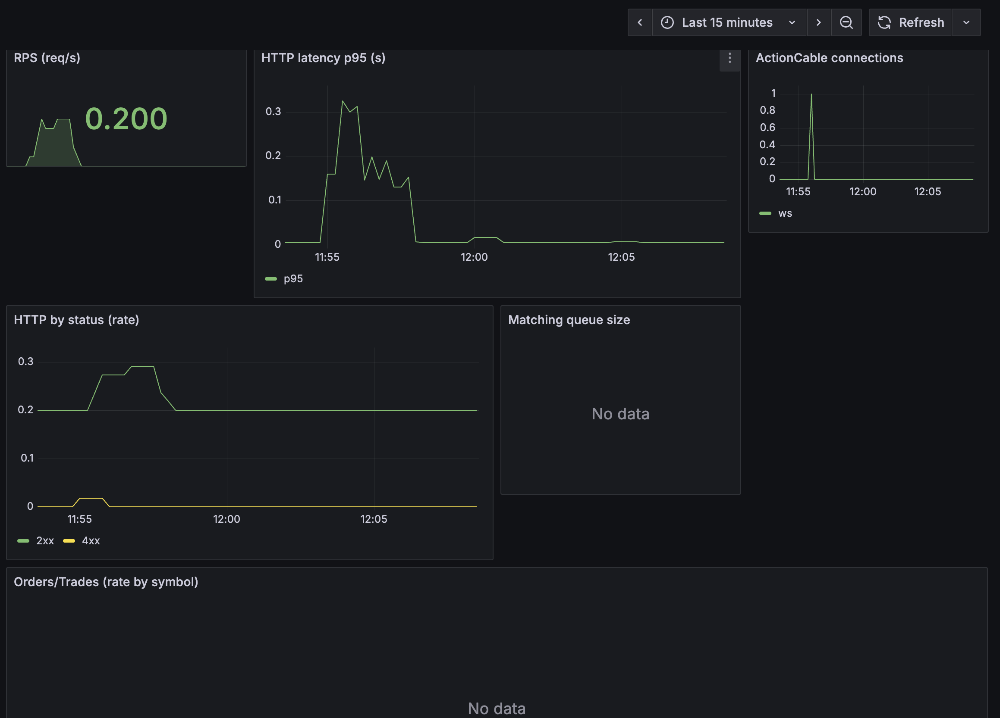

# Phase 2 — Rapport final (format Arc42)

Ce document suit la structure Arc42 (1→12) pour aligner la Phase 2 sur la documentation de la Phase 1. Il référence les vues 4+1 centralisées, les ADRs centralisés et intègre les captures `docs/phase2/screenshots/`.

---

## 1. Introduction & Objectifs
- But: décomposer le monolithe vers des microservices pilotés par une API Gateway, avec observabilité prête pour une démo (k6, Prometheus, Grafana) et temps réel (ActionCable).
- Portée Phase 2: services Orders/Portfolios/Reporting, gateway Kong (DB‑less), métriques Prometheus, tableaux de bord Grafana, WS `/cable`.

## 2. Contraintes
- Docker-first; Kong DB-less; Postgres unique (démo); JWT HS256; CORS/key‑auth au gateway.
- Démo locale (Compose) avec cibles Prometheus et panels Grafana.

## 3. Contexte & Périmètre
- Externe: k6, Grafana/Prometheus, Kong.
- Interne: services Rails (orders-a, orders-b, portfolios, reporting) + /metrics + /health.

## 4. Stratégie de solution
- DDD (bounded contexts), services stateless, Kong en frontal, métriques custom `/metrics`, dashboards Golden Signals.
- WS ActionCable avec authentification JWT et jauges/counters pour connexions.

## 5. Vue Building Block (structure)
- Services: orders-a/b, portfolios, reporting; gateway; observabilité; postgres.
- Code de métriques: `app/infrastructure/observability/metrics.rb` + subscribers.

## 6. Vue Runtime (scénarios)
- Création d’ordre → mise en file → matching → trade → mise à jour portefeuille → broadcast ActionCable.
- Routage via Kong (clé API + JWT) → service amont → métriques.

## Synthèse des cas d’usage par phase
- Phase 1 (réalisés):
  - UC‑01 — Inscription & Vérification (email) ↔ flux REST + token de vérif
  - UC‑02 — Authentification MFA (2 étapes) ↔ login → verify_mfa → JWT
  - UC‑05 — Placement d’ordre (pré‑trade + ACK) ↔ mise en file matching
- Phase 2 (réalisés):
  - UC‑03 — Dépôt de fonds idempotent (Idempotency‑Key)
  - UC‑04 — Données de marché en temps réel (ActionCable / WS)
  - UC‑06 — Modifier / Annuler un ordre (verrouillage optimiste)

Les diagrammes UML (PNG) correspondants sont intégrés en Annexes D.

## 7. Vue Déploiement
- Compose: base (web+postgres), gateway (kong+microservices), observability (prom+grafana).
- Réseaux: `brokerx_default`.

## 8. Concepts transverses
- Auth JWT, idempotence pour dépôts, `/metrics` Prometheus, CORS/key‑auth au gateway, LB entre orders‑a/b.

## 9. Décisions architecturales (ADRs)
- ADR 005 — Kong DB‑less: `docs/architecture/adr005_kong_gateway.md`
- ADR 006 — Prometheus + Grafana: `docs/architecture/adr006_prometheus_grafana.md`
- ADR 007 — ActionCable temps réel: `docs/architecture/adr007_actioncable_ws.md`

## 10. Scénarios de qualité (NFR)
- Cibles: p95 < 600 ms (5 VUs/45s), ≥ 10 req/s, cibles Prometheus UP.
- Observé (smoke): direct p95 ≈ 39–40 ms; gateway p95 ≈ 33–38 ms; 0 % échecs; WS actif pendant runs.

## 11. Risques & mitigations
- Granularité métriques Kong variable → utiliser séries nginx/global; vérifier reload Prom.
- Jauge WS transitoire → maintenir des connexions via k6 WS pendant les captures.

## 12. Roadmap & Dette technique
- DB par service, isolation accrue, auth « prod », CI/CD renforcée; tracing distribué ultérieur.

---

## Annexes A — Vues 4+1 (références)
- Logique/Processus/Développement/Physique/Scénarios: `docs/architecture/4plus1_views/`

## Annexes B — Captures (preuves)
- Grafana – Vue d'ensemble
  Aperçu « Golden Signals » (latence p95, erreurs, RPS, saturation) pendant 5–15 minutes d'un run k6.


- Grafana – Panneaux Gateway
  Focus Gateway/Kong: connexions, RPS, latence upstream; illustre l'équilibrage entre orders‑a/b (en‑tête X‑Instance côté k6).


- Prometheus – Targets
  Toutes les cibles doivent être UP (services et kong) pour alimenter Grafana.


- Prometheus – p95
  Requête type (histogram_quantile sur http_request_duration_seconds_bucket) pour visualiser p95.


- k6 direct microservices
  Exécution locale ciblant directement `portfolios` et `orders-a` (réseaux compose); p95 < 600 ms, 0 % échec.
```zsh
redaelmansouri@Redas-Laptop brokerx % k6 run load/k6/direct_microservices_smoke.js 
-e PORTFOLIOS_URL=http://localhost:3103 -e ORDERS_URL=http://localhost:3101 -e TOKE
N=eyJhbGciOiJIUzI1NiJ9.eyJjbGllbnRfaWQiOjEsImlzcyI6ImJyb2tlcngiLCJhdWQiOiJicm9rZXJ4
LndlYiIsImlhdCI6MTc2MTY3MDg5NywiZXhwIjoxNzYxNzU3Mjk3fQ.uveb09gOKLwwEwB29PY7hNN5hBDG
rQbKLE8qZDWKvqo -e VUS=5 -e DURATION=45s

         /\      Grafana   /‾‾/  
    /\  /  \     |\  __   /  /   
   /  \/    \    | |/ /  /   ‾‾\ 
  /          \   |   (  |  (‾)  |
 / __________ \  |_|\_\  \_____/ 

     execution: local
        script: load/k6/direct_microservices_smoke.js
        output: -

     scenarios: (100.00%) 1 scenario, 5 max VUs, 1m15s max duration (incl. graceful stop):
              * default: 5 looping VUs for 45s (gracefulStop: 30s)


  █ THRESHOLDS 

    http_req_duration
    ✓ 'p(95)<600' p(95)=36.4ms

    http_req_failed
    ✓ 'rate<0.05' rate=0.00%


  █ TOTAL RESULTS 

    checks_total.......: 845     18.743991/s
    checks_succeeded...: 100.00% 845 out of 845
    checks_failed......: 0.00%   0 out of 845

    ✓ portfolio 200/401
    ✓ deposit 200/201
    ✓ order ok

    HTTP
    http_req_duration..............: avg=17.47ms  min=3.07ms   med=13.64ms  max=138.6ms  p(90)=29.46ms p(95)=36.4ms  
      { expected_response:true }...: avg=17.47ms  min=3.07ms   med=13.64ms  max=138.6ms  p(90)=29.46ms p(95)=36.4ms  
    http_req_failed................: 0.00%  0 out of 845
    http_reqs......................: 845    18.743991/s

    EXECUTION
    iteration_duration.............: avg=536.51ms min=508.45ms med=533.41ms max=805.58ms p(90)=545.4ms p(95)=551.26ms
    iterations.....................: 420    9.31654/s
    vus............................: 5      min=5        max=5
    vus_max........................: 5      min=5        max=5

    NETWORK
    data_received..................: 465 kB 10 kB/s
    data_sent......................: 330 kB 7.3 kB/s


running (0m45.1s), 0/5 VUs, 420 complete and 0 interrupted iterations
default ✓ [======================================] 5 VUs  45s
```

- k6 Gateway
  Exécution via Kong (`BASE_URL=http://kong:8080`) avec `APIKEY` et JWT; vérifie l’en‑tête `X-Instance` pour illustrer le LB entre orders‑a/b.
```zsh
 redaelmansouri@Redas-Laptop brokerx % k6 run load/k6/gateway_smoke.js -e BASE_URL=h
ttp://localhost:8080 -e APIKEY=brokerx-key-123 -e TOKEN=eyJhbGciOiJIUzI1NiJ9.eyJjbG
llbnRfaWQiOjEsImlzcyI6ImJyb2tlcngiLCJhdWQiOiJicm9rZXJ4LndlYiIsImlhdCI6MTc2MTY3MDg5N
ywiZXhwIjoxNzYxNzU3Mjk3fQ.uveb09gOKLwwEwB29PY7hNN5hBDGrQbKLE8qZDWKvqo -e VUS=5 -e D
URATION=45s

         /\      Grafana   /‾‾/  
    /\  /  \     |\  __   /  /   
   /  \/    \    | |/ /  /   ‾‾\ 
  /          \   |   (  |  (‾)  |
 / __________ \  |_|\_\  \_____/ 

     execution: local
        script: load/k6/gateway_smoke.js
        output: -

     scenarios: (100.00%) 1 scenario, 5 max VUs, 1m15s max duration (incl. graceful stop):
              * default: 5 looping VUs for 45s (gracefulStop: 30s)


  █ THRESHOLDS 

    http_req_duration
    ✓ 'p(95)<600' p(95)=37.21ms

    http_req_failed
    ✓ 'rate<0.05' rate=0.00%


  █ TOTAL RESULTS 

    checks_total.......: 1265    28.04732/s
    checks_succeeded...: 100.00% 1265 out of 1265
    checks_failed......: 0.00%   0 out of 1265

    ✓ portfolio 200/401
    ✓ deposit 200/201
    ✓ order ok
    ✓ has X-Instance

    HTTP
    http_req_duration..............: avg=17.79ms min=3.58ms   med=13.54ms  max=142.47ms p(90)=30.38ms  p(95)=37.21ms
      { expected_response:true }...: avg=17.79ms min=3.58ms   med=13.54ms  max=142.47ms p(90)=30.38ms  p(95)=37.21ms
    http_req_failed................: 0.00%  0 out of 845
    http_reqs......................: 845    18.735167/s

    EXECUTION
    iteration_duration.............: avg=536.8ms min=510.07ms med=532.79ms max=739.56ms p(90)=549.88ms p(95)=582.4ms
    iterations.....................: 420    9.312154/s
    vus............................: 5      min=5        max=5
    vus_max........................: 5      min=5        max=5

    NETWORK
    data_received..................: 617 kB 14 kB/s
    data_sent......................: 351 kB 7.8 kB/s


running (0m45.1s), 0/5 VUs, 420 complete and 0 interrupted iterations
default ✓ [======================================] 5 VUs  45s
```

- Kong /metrics
  Extrait du endpoint Admin `/metrics` exposé par le plugin Prometheus de Kong (scrapé par Prometheus).
```zsh
redaelmansouri@Redas-Laptop brokerx % curl -s http://localhost:8001/metrics | head 
-n 40
# HELP kong_datastore_reachable Datastore reachable from Kong, 0 is unreachable
# TYPE kong_datastore_reachable gauge
kong_datastore_reachable 1
# HELP kong_memory_lua_shared_dict_bytes Allocated slabs in bytes in a shared_dict
# TYPE kong_memory_lua_shared_dict_bytes gauge
kong_memory_lua_shared_dict_bytes{node_id="9d2a62e8-341a-4251-a4d9-2a0afb58d0ff",shared_dict="kong",kong_subsystem="http"} 45056
kong_memory_lua_shared_dict_bytes{node_id="9d2a62e8-341a-4251-a4d9-2a0afb58d0ff",shared_dict="kong_cluster_events",kong_subsystem="http"} 40960
kong_memory_lua_shared_dict_bytes{node_id="9d2a62e8-341a-4251-a4d9-2a0afb58d0ff",shared_dict="kong_core_db_cache",kong_subsystem="http"} 802816
kong_memory_lua_shared_dict_bytes{node_id="9d2a62e8-341a-4251-a4d9-2a0afb58d0ff",shared_dict="kong_core_db_cache_miss",kong_subsystem="http"} 86016
kong_memory_lua_shared_dict_bytes{node_id="9d2a62e8-341a-4251-a4d9-2a0afb58d0ff",shared_dict="kong_db_cache",kong_subsystem="http"} 802816
kong_memory_lua_shared_dict_bytes{node_id="9d2a62e8-341a-4251-a4d9-2a0afb58d0ff",shared_dict="kong_db_cache_miss",kong_subsystem="http"} 86016
kong_memory_lua_shared_dict_bytes{node_id="9d2a62e8-341a-4251-a4d9-2a0afb58d0ff",shared_dict="kong_healthchecks",kong_subsystem="http"} 40960
kong_memory_lua_shared_dict_bytes{node_id="9d2a62e8-341a-4251-a4d9-2a0afb58d0ff",shared_dict="kong_locks",kong_subsystem="http"} 61440
kong_memory_lua_shared_dict_bytes{node_id="9d2a62e8-341a-4251-a4d9-2a0afb58d0ff",shared_dict="kong_rate_limiting_counters",kong_subsystem="http"} 86016
kong_memory_lua_shared_dict_bytes{node_id="9d2a62e8-341a-4251-a4d9-2a0afb58d0ff",shared_dict="kong_secrets",kong_subsystem="http"} 40960
kong_memory_lua_shared_dict_bytes{node_id="9d2a62e8-341a-4251-a4d9-2a0afb58d0ff",shared_dict="prometheus_metrics",kong_subsystem="http"} 40960
# HELP kong_memory_lua_shared_dict_total_bytes Total capacity in bytes of a shared_dict
# TYPE kong_memory_lua_shared_dict_total_bytes gauge
kong_memory_lua_shared_dict_total_bytes{node_id="9d2a62e8-341a-4251-a4d9-2a0afb58d0ff",shared_dict="kong",kong_subsystem="http"} 5242880
kong_memory_lua_shared_dict_total_bytes{node_id="9d2a62e8-341a-4251-a4d9-2a0afb58d0ff",shared_dict="kong_cluster_events",kong_subsystem="http"} 5242880
kong_memory_lua_shared_dict_total_bytes{node_id="9d2a62e8-341a-4251-a4d9-2a0afb58d0ff",shared_dict="kong_core_db_cache",kong_subsystem="http"} 134217728
kong_memory_lua_shared_dict_total_bytes{node_id="9d2a62e8-341a-4251-a4d9-2a0afb58d0ff",shared_dict="kong_core_db_cache_miss",kong_subsystem="http"} 12582912
kong_memory_lua_shared_dict_total_bytes{node_id="9d2a62e8-341a-4251-a4d9-2a0afb58d0ff",shared_dict="kong_db_cache",kong_subsystem="http"} 134217728
kong_memory_lua_shared_dict_total_bytes{node_id="9d2a62e8-341a-4251-a4d9-2a0afb58d0ff",shared_dict="kong_db_cache_miss",kong_subsystem="http"} 12582912
kong_memory_lua_shared_dict_total_bytes{node_id="9d2a62e8-341a-4251-a4d9-2a0afb58d0ff",shared_dict="kong_healthchecks",kong_subsystem="http"} 5242880
kong_memory_lua_shared_dict_total_bytes{node_id="9d2a62e8-341a-4251-a4d9-2a0afb58d0ff",shared_dict="kong_locks",kong_subsystem="http"} 8388608
kong_memory_lua_shared_dict_total_bytes{node_id="9d2a62e8-341a-4251-a4d9-2a0afb58d0ff",shared_dict="kong_rate_limiting_counters",kong_subsystem="http"} 12582912
kong_memory_lua_shared_dict_total_bytes{node_id="9d2a62e8-341a-4251-a4d9-2a0afb58d0ff",shared_dict="kong_secrets",kong_subsystem="http"} 5242880
kong_memory_lua_shared_dict_total_bytes{node_id="9d2a62e8-341a-4251-a4d9-2a0afb58d0ff",shared_dict="prometheus_metrics",kong_subsystem="http"} 5242880
# HELP kong_memory_workers_lua_vms_bytes Allocated bytes in worker Lua VM
# TYPE kong_memory_workers_lua_vms_bytes gauge
kong_memory_workers_lua_vms_bytes{node_id="9d2a62e8-341a-4251-a4d9-2a0afb58d0ff",pid="1331",kong_subsystem="http"} 77742284
kong_memory_workers_lua_vms_bytes{node_id="9d2a62e8-341a-4251-a4d9-2a0afb58d0ff",pid="1332",kong_subsystem="http"} 68701232
kong_memory_workers_lua_vms_bytes{node_id="9d2a62e8-341a-4251-a4d9-2a0afb58d0ff",pid="1333",kong_subsystem="http"} 83319171
kong_memory_workers_lua_vms_bytes{node_id="9d2a62e8-341a-4251-a4d9-2a0afb58d0ff",pid="1334",kong_subsystem="http"} 67751560
kong_memory_workers_lua_vms_bytes{node_id="9d2a62e8-341a-4251-a4d9-2a0afb58d0ff",pid="1335",kong_subsystem="http"} 54857695
kong_memory_workers_lua_vms_bytes{node_id="9d2a62e8-341a-4251-a4d9-2a0afb58d0ff",pid="1336",kong_subsystem="http"} 54857416
kong_memory_workers_lua_vms_bytes{node_id="9d2a62e8-341a-4251-a4d9-2a0afb58d0ff",pid="1337",kong_subsystem="http"} 54859371
kong_memory_workers_lua_vms_bytes{node_id="9d2a62e8-341a-4251-a4d9-2a0afb58d0ff",pid="1338",kong_subsystem="http"} 68104347
# HELP kong_nginx_connections_total Number of connections by subsystem
```

## Annexes C — Commandes utiles (terminal)

### k6 via Gateway (Docker)
```bash
docker run --rm --network brokerx_default -v "$PWD":/scripts -w /scripts grafana/k6 \
  run load/k6/gateway_smoke.js \
  -e BASE_URL=http://kong:8080 -e APIKEY=brokerx-key-123 -e TOKEN=$TOKEN \
  -e VUS=5 -e DURATION=45s
```

### k6 direct microservices (Docker)
```bash
docker run --rm --network brokerx_default -v "$PWD":/scripts -w /scripts grafana/k6 \
  run load/k6/direct_microservices_smoke.js \
  -e PORTFOLIOS_URL=http://portfolios:3000 -e ORDERS_URL=http://orders-a:3000 \
  -e TOKEN=$TOKEN -e VUS=5 -e DURATION=45s
```

### k6 WebSocket (maintenir les connexions)
```bash
docker run --rm --name k6-ws --network brokerx_default -v "$PWD":/scripts -w /scripts grafana/k6 \
  run load/k6/cable_connect.js \
  -e WS_URL=ws://portfolios:3000/cable -e TOKEN=$TOKEN -e VUS=5 -e DURATION=5m -e WS_HOLD_MS=290000
```

### Prometheus/Kong
```bash
curl -s http://localhost:9090/targets | head -n 80
curl -s http://localhost:8001/metrics | head -n 40
```

## Reproductibilité (< 30 min)
Voir README racine, section « Phase 2 — Reproductibilité (< 30 min) ».

## Liens rapides
- Grafana : http://localhost:3001
- Prometheus : http://localhost:9090
- Kong Admin metrics : http://localhost:8001/metrics
- Dashboards JSON :
  - `docs/observability/grafana/brokerx-dashboard.json`
  - `docs/observability/grafana/kong-gateway-dashboard.json`

## Annexes D — Cas d’usage (UML, PNG)

### UC réalisés — Phase 1

- UC‑01 — Inscription & Vérification


  Création de compte → statut Pending → validation par lien/email → statut Active.

- UC‑02 — Authentification MFA


  Login (email+mot de passe) → envoi code MFA → vérification → émission d'un JWT HS256.

- UC‑05 — Placement d'ordre


  Contrôles pré‑trade, réservation de fonds (ACHAT), persistance, mise en file vers le moteur d'appariement et ACK.

### UC réalisés — Phase 2

- UC‑03 — Dépôt de fonds idempotent


  Dépôt avec `Idempotency-Key` garantissant l'absence de doublon (retourne le résultat initial si répété).

- UC‑04 — Données de marché en temps réel (ActionCable)


  Connexion WS `/cable?token=JWT`, abonnement `MarketChannel`, diffusion de messages `quote`/`orderbook`/`status`.

- UC‑06 — Modifier / Annuler un ordre


  Remplacement/annulation sous verrouillage optimiste (`lock_version`), libération des fonds réservés le cas échéant.
