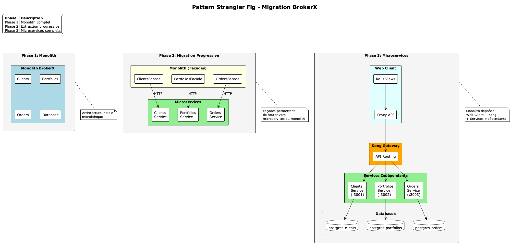
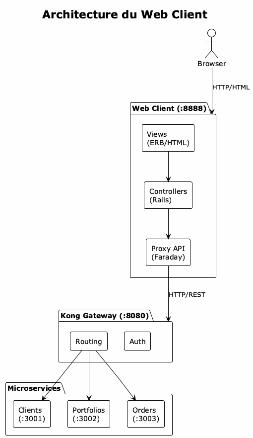
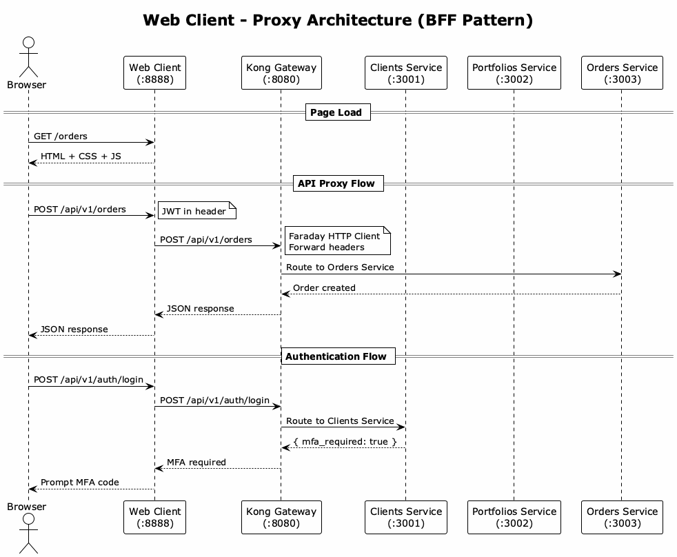
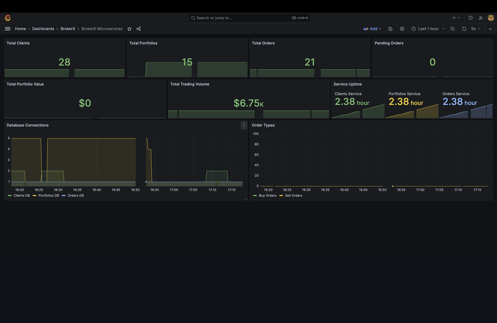

# Rapport Phase 3 - BrokerX
## Documentation Architecturale ARC42

**Date**: 4 décembre 2025  
**Version**: 2.0  
**Projet**: BrokerX - Plateforme de Courtage en Ligne  
**Phase**: Migration Monolith → Microservices + Architecture Événementielle

---

## Table des matières

1. [Introduction et Objectifs](#1-introduction-et-objectifs)
2. [Contraintes](#2-contraintes)
3. [Portée et Contexte](#3-portée-et-contexte)
4. [Stratégie de Solution](#4-stratégie-de-solution)
5. [Vue des Blocs de Construction](#5-vue-des-blocs-de-construction)
6. [Vue d'Exécution](#6-vue-dexécution)
7. [Vue de Déploiement](#7-vue-de-déploiement)
8. [Concepts Transversaux](#8-concepts-transversaux)
9. [Décisions Architecturales](#9-décisions-architecturales)
10. [Qualité](#10-qualité)
11. [Risques et Dette Technique](#11-risques-et-dette-technique)
12. [Glossaire](#12-glossaire)

---

## 1. Introduction et Objectifs

### 1.1 Objectifs de la Phase 3

La Phase 3 du projet BrokerX vise à transformer l'application d'une architecture monolithique vers une architecture microservices avec communication événementielle.

| Objectif | Description | Statut |
|----------|-------------|--------|
| **Migration Microservices** | Décomposition du monolith en 3 services indépendants | Complété |
| **Web Client** | Interface web Rails connectée aux microservices via Kong | Complété |
| **UC-07 Appariement** | Matching engine avec saga chorégraphiée | Complété |
| **UC-08 Notifications** | Notifications temps réel via WebSocket | Complété |
| **Architecture Événementielle** | Communication asynchrone via EventBus | Complété |
| **Observabilité** | Dashboards Grafana + métriques Prometheus | Complété |
| **Load Balancing** | Nginx + Kong API Gateway | Complété |

### 1.2 Parties Prenantes

| Rôle | Préoccupations | Attentes |
|------|----------------|----------|
| **Développeurs** | Maintenabilité, déploiement indépendant | Services découplés, tests isolés |
| **Opérations** | Monitoring, scalabilité | Métriques, logs centralisés |
| **Clients** | Temps réel, fiabilité | Notifications instantanées, cohérence |
| **Architecture** | Évolutivité, patterns | Saga, Event-Driven, CQRS-ready |

### 1.3 Qualités Requises

| Attribut | Description |
|----------|-------------|
| **Scalabilité** | Horizontal scaling par service |
| **Résilience** | Compensation automatique (Saga Pattern) |
| **Performance** | < 100ms latence p95 |
| **Observabilité** | Traces, métriques, logs corrélés |
| **Maintenabilité** | Services indépendants, CI/CD séparé |

---

## 2. Contraintes

### 2.1 Contraintes Techniques

| Contrainte | Description | Impact |
|------------|-------------|--------|
| **Ruby on Rails** | Framework imposé pour tous les services | Cohérence technologique |
| **PostgreSQL** | Base de données relationnelle par service | Database-per-service pattern |
| **Redis** | Cache + EventBus (Pub/Sub) | Pas de Kafka (complexité) |
| **Docker** | Containerisation obligatoire | Environnements reproductibles |
| **Kong** | API Gateway existant | Routing, rate limiting |

### 2.2 Contraintes Organisationnelles

- **Délai**: Phase 3 à livrer avant décembre 2025
- **Équipe**: Déploiement indépendant souhaité par service
- **Budget**: Infrastructure cloud limitée (pas de Kafka managé)

### 2.3 Conventions

- **Versioning API**: `/api/v1/` pour toutes les routes
- **Logs**: Format JSON structuré avec `correlation_id`
- **Tests**: Couverture > 80% pour les sagas

---

## 3. Portée et Contexte

### 3.1 Contexte Métier

BrokerX est une plateforme de courtage permettant aux clients de :
- Créer un compte et gérer leur portefeuille
- Passer des ordres d'achat/vente sur des actions
- Recevoir des confirmations d'exécution en temps réel

### 3.2 Contexte Technique


### 3.3 Interfaces Externes

| Interface | Type | Description |
|-----------|------|-------------|
| **REST API** | Synchrone | CRUD clients, ordres, portfolios |
| **WebSocket** | Temps réel | ActionCable pour notifications |
| **EventBus** | Asynchrone | Redis Pub/Sub entre services |
| **SMTP** | Email | MailHog (dev) / SMTP (prod) |

---

## 4. Stratégie de Solution

### 4.1 Migration Monolith → Microservices

La migration a suivi le pattern **Strangler Fig** :



#### Étapes de Migration

1. **Extraction du Clients Service**
   - Authentification, MFA, gestion profil
   - Base de données dédiée (postgres-clients)

2. **Extraction du Portfolios Service**
   - Gestion des soldes, dépôts, réservation fonds
   - Communication avec Clients via JWT validation

3. **Extraction du Orders Service**
   - Matching engine, ordres, trades
   - Saga chorégraphiée avec Portfolios

4. **Dépréciation du Monolith**
   - `docker-compose.yml` → `docker-compose.monolith.yml`
   - Création de `app/DEPRECATED.md`

### 4.2 Architecture Événementielle

L'architecture événementielle est implémentée via **Redis Pub/Sub** :

```ruby
# services/orders-service/lib/event_bus.rb
module EventBus
  module Events
    ORDER_REQUESTED = 'order.requested'
    FUNDS_RESERVED = 'funds.reserved'
    FUNDS_RELEASED = 'funds.released'
    EXECUTION_REPORT = 'execution.report'
    TRADE_EXECUTED = 'trade.executed'
  end

  def self.publish(event_type, data, correlation_id: nil)
    event = build_event(event_type, data, correlation_id)
    redis.publish("eventbus:#{event_type}", event.to_json)
  end

  def self.subscribe(*event_types, &block)
    subscriber_redis.subscribe(*channels) do |on|
      on.message { |channel, msg| block.call(parse(msg)) }
    end
  end
end
```

#### Pourquoi Redis Pub/Sub et non Kafka ?

| Critère | Redis Pub/Sub | Kafka |
|---------|---------------|-------|
| **Complexité** | Simple, déjà présent | Cluster ZooKeeper requis |
| **Persistance** | Optionnelle (sorted sets) | Native |
| **Latence** | < 1ms | ~5-10ms |
| **Volume** | Adapté (< 10k msg/s) | Millions msg/s |
| **Coût** | Inclus dans infra | Kafka managé = $$$$ |

**Décision**: Redis Pub/Sub est suffisant pour le volume actuel. Migration vers Kafka prévue si > 10k msg/s.

---

## 5. Vue des Blocs de Construction

### 5.1 Décomposition en Services


#### Web Client (:8888)

| Composant | Responsabilité |
|-----------|----------------|
| **StaticController** | Page d'accueil, login/register modals |
| **PortfoliosController** | Vue du portefeuille |
| **OrdersController** | Interface de trading |
| **Api::V1::ProxyController** | Proxy API vers Kong Gateway |
| **HealthController** | Health check endpoint |

Le Web Client est une application Rails **sans base de données** qui :
- Sert les vues HTML identiques au monolith
- Proxy toutes les requêtes API vers Kong Gateway
- Gère l'authentification JWT côté client (localStorage)
- Se connecte aux WebSockets via Kong pour les notifications temps réel



#### Clients Service (:3001)

| Composant | Responsabilité |
|-----------|----------------|
| **ClientsController** | CRUD clients |
| **AuthController** | Login, MFA |
| **VerificationController** | Email verification |
| **JwtService** | Token generation/validation |
| **MfaService** | TOTP authentication |

#### Portfolios Service (:3002)

| Composant | Responsabilité |
|-----------|----------------|
| **PortfoliosController** | Gestion portfolios |
| **DepositsController** | Dépôts/retraits |
| **InternalController** | Reserve/release funds |
| **OrderRequestedHandler** | Event handler - réservation |
| **TradeExecutedHandler** | Event handler - positions |

#### Orders Service (:3003)

| Composant | Responsabilité |
|-----------|----------------|
| **OrdersController** | Create, cancel, replace |
| **MarketDataController** | Données de marché |
| **TradingSaga** | Orchestration avec compensation |
| **FundsReservedHandler** | Event handler |
| **FundsReservationFailedHandler** | Event handler |
| **OrdersChannel** | WebSocket notifications |
| **MarketChannel** | Real-time quotes |
| **MatchingEngine** | Order book, price-time priority |

### 5.2 Composants Clés

#### TradingSaga (UC-07)

```ruby
# services/orders-service/app/sagas/trading_saga.rb
class TradingSaga
  STEPS = [:validate, :reserve_funds, :create_order, :submit_to_matching]

  def execute(client_id:, symbol:, direction:, ...)
    # Step 1: Validate
    validate_order!(...)

    # Step 2: Reserve funds (buy orders only)
    if direction == 'buy'
      reserve_funds!(client_id, estimated_cost, correlation_id)
    end

    # Step 3: Create order
    @order = create_order!(...)

    # Step 4: Submit to matching
    submit_to_matching_engine!(@order)

  rescue => e
    compensate!(client_id, estimated_cost) if @funds_reserved
    handle_failure(e, 'saga_failed')
  end
end
```

#### EventBus (Communication Asynchrone)

```ruby
# Publier un événement
EventBus.publish(
  EventBus::Events::ORDER_REQUESTED,
  { order_id: order.id, client_id: client.id, ... },
  correlation_id: SecureRandom.uuid
)

# S'abonner aux événements
EventBus.subscribe_async(
  EventBus::Events::FUNDS_RESERVED,
  handler: FundsReservedHandler.new
)
```

---

## 6. Vue d'Exécution

### 6.1 UC-07: Appariement d'Ordres (Saga Chorégraphiée)


### 6.2 UC-08: Notifications Temps Réel


### 6.3 Flux de Compensation (Échec Réservation)


---

## 7. Vue de Déploiement

### 7.1 Architecture Docker


#### Services et Ports

| Service | Port | Description |
|---------|------|-------------|
| **Web Client** | 8888 | Interface utilisateur Rails |
| **Kong Gateway** | 8080 | API Gateway (routing, auth) |
| **Clients Service** | 3001 | Authentification, MFA |
| **Portfolios Service** | 3002 | Gestion portefeuilles |
| **Orders Service** | 3003 | Trading, matching engine |
| **Redis** | 6379 | Cache + EventBus |
| **PostgreSQL** | 5432-5434 | Bases de données par service |
| **Grafana** | 3050 | Dashboards observabilité |
| **Prometheus** | 9090 | Collecte métriques |

### 7.2 Web Client - Proxy Architecture

Le Web Client utilise le pattern **Backend-for-Frontend (BFF)** :



```ruby
# services/web-client/app/controllers/api/v1/proxy_controller.rb
class Api::V1::ProxyController < ApplicationController
  def clients_create
    proxy_post('/api/v1/clients')
  end

  def orders_create
    proxy_post('/api/v1/orders')
  end

  private

  def proxy_post(path)
    response = @client.post(path) do |req|
      req.headers = proxy_headers
      req.body = request.raw_post
    end
    render json: response.body, status: response.status
  end

  def kong_gateway_url
    ENV.fetch('KONG_GATEWAY_URL', 'http://kong:8000')
  end
end
```

### 7.3 Configuration Load Balancing

```yaml
# docker-compose.lb.yml (multi-replica)
services:
  clients-1:
    build: ./services/clients-service
    environment:
      INSTANCE_ID: clients-1
  
  clients-2:
    build: ./services/clients-service
    environment:
      INSTANCE_ID: clients-2
  
  orders-1:
    build: ./services/orders-service
    environment:
      INSTANCE_ID: orders-1
  
  orders-2:
    build: ./services/orders-service
    environment:
      INSTANCE_ID: orders-2
  
  nginx-lb:
    image: nginx:alpine
    volumes:
      - ./nginx/nginx.microservices.conf:/etc/nginx/nginx.conf
```

```nginx
# nginx/nginx.microservices.conf
upstream orders_upstream {
    least_conn;
    server orders-1:3000 weight=2;
    server orders-2:3000;
    server orders-3:3000;
}

upstream clients_upstream {
    least_conn;
    server clients-1:3000;
    server clients-2:3000;
}
```

### 7.3 Commandes de Déploiement

```bash
# Démarrage standard
docker compose up -d

# Avec load balancing (multi-instance)
docker compose -f docker-compose.yml -f docker-compose.lb.yml up -d

# Avec observabilité
docker compose --profile observability up -d

# Retour au monolith (rollback)
./scripts/rollback_to_monolith.sh
```

---

## 8. Concepts Transversaux

### 8.1 Pattern Saga Chorégraphiée


La saga chorégraphiée coordonne les transactions distribuées sans orchestrateur central.

**Flux normal :**
1. Orders Service publie `order.requested`
2. Portfolios Service réserve les fonds (transaction locale)
3. Portfolios Service publie `funds.reserved`
4. Orders Service soumet au matching (transaction locale)
5. Orders Service publie `execution.report`
6. Portfolios Service met à jour la position (transaction locale)
7. Portfolios Service publie `position.updated`

**Compensation (sur échec) :**
- `funds.reservation_failed` → Order marqué "rejected"
- Order creation failed → `funds.released` publié

### 8.2 Correlation ID

Chaque saga génère un `correlation_id` unique pour tracer le flux :

```ruby
# Création d'événement avec correlation
event = {
  id: SecureRandom.uuid,
  type: 'order.requested',
  correlation_id: 'saga-abc-123',  # Même ID tout au long de la saga
  timestamp: Time.current.iso8601,
  data: { order_id: 42, ... }
}

# Dans les logs
Rails.logger.info("[SAGA] correlation_id=saga-abc-123 step=reserve_funds status=success")
```

### 8.3 Idempotence

Les handlers vérifient l'idempotence pour éviter les doubles traitements :

```ruby
class FundsReservedHandler
  def handle(event)
    order = Order.find(event[:data][:order_id])
    
    # Idempotency check
    return if order.status != 'pending_funds'
    
    # Process...
  end
end
```

### 8.4 Outbox Pattern

Les événements sont d'abord persistés localement avant publication :

```ruby
ActiveRecord::Base.transaction do
  order.update!(status: 'new')
  
  OutboxEvent.create!(
    aggregate_type: 'Order',
    aggregate_id: order.id,
    event_type: 'order.placed',
    payload: { ... }
  )
end

# Dispatcher asynchrone publie vers Redis
OutboxDispatcher.process_pending_events
```

---

## 9. Décisions Architecturales

### ADR-010: Saga Pattern pour Transactions Distribuées

| Aspect | Décision |
|--------|----------|
| **Contexte** | Transactions spanning Orders + Portfolios services |
| **Décision** | Saga chorégraphiée via Redis Pub/Sub |
| **Alternatives rejetées** | 2PC (trop rigide), Saga orchestrée (SPOF) |
| **Conséquences** | + Résilience, + Scalabilité, - Complexité debug |

### ADR-009: Load Balancing avec Nginx

| Aspect | Décision |
|--------|----------|
| **Contexte** | Scalabilité horizontale des services |
| **Décision** | Nginx least_conn + Kong pour API Gateway |
| **Alternatives rejetées** | HAProxy (overkill), Kong seul (limitations) |
| **Conséquences** | + Performance, + Flexibilité, - Composant supplémentaire |

### ADR-008: Redis comme Event Bus

| Aspect | Décision |
|--------|----------|
| **Contexte** | Communication asynchrone inter-services |
| **Décision** | Redis Pub/Sub (DB 15 dédié) |
| **Alternatives rejetées** | Kafka (complexité), RabbitMQ (coût) |
| **Conséquences** | + Simplicité, + Performance, - Pas de replay natif |

---

## 10. Qualité

### 10.1 Observabilité - Dashboards Grafana

Trois dashboards Grafana ont été implémentés pour surveiller l'ensemble de la plateforme BrokerX :

#### Dashboard BrokerX Microservices



Ce dashboard offre une vue d'ensemble des métriques métier :
- **Total Clients/Portfolios/Orders** : compteurs en temps réel
- **Service Uptime** : disponibilité de chaque microservice
- **Database Connections** : connexions aux bases de données par service
- **Trading Volume** : volume total des transactions

#### Dashboard Golden Signals


Métriques surveillées :
- **Latency**: `histogram_quantile(0.95, http_request_duration_seconds_bucket)`
- **Traffic**: `sum(rate(http_requests_total[1m]))`
- **Errors**: `sum(rate(http_requests_total{code=~"5.."}[1m]))`
- **Saturation**: `matching_queue_size`

```json
// config/observability/grafana/brokerx-dashboard.json
{
  "panels": [
    { "title": "RPS (req/s)", "expr": "sum(rate(http_requests_total[1m]))" },
    { "title": "HTTP latency p95", "expr": "histogram_quantile(0.95, ...)" },
    { "title": "HTTP by status", "expr": "sum by (code)(rate(http_requests_total[1m]))" },
    { "title": "Matching queue", "expr": "matching_queue_size" },
    { "title": "WebSocket connections", "expr": "cable_connections" }
  ]
}
```

#### Dashboard Kong Gateway


Métriques Kong :
- `kong_http_requests_total` par route
- `kong_latency_ms` par service
- `kong_bandwidth` (bytes in/out)

### 10.2 Configuration Prometheus

```yaml
# config/observability/prometheus-microservices.yml
scrape_configs:
  - job_name: 'clients-service'
    static_configs:
      - targets: ['brokerx-clients-service:3000']
    metrics_path: '/metrics'

  - job_name: 'portfolios-service'
    static_configs:
      - targets: ['brokerx-portfolios-service:3000']

  - job_name: 'orders-service'
    static_configs:
      - targets: ['brokerx-orders-service:3000']

  - job_name: 'kong'
    static_configs:
      - targets: ['brokerx-kong:8001']
```

### 10.3 Tests E2E

```bash
# Test smoke (santé des services)
./test/e2e/smoke_test.sh

# Tests complets
./test/e2e/run_e2e_tests.sh

# Tests saga compensation
ruby test/e2e/saga_compensation_e2e_test.rb
```

Couverture des tests :
-  Création d'ordre (happy path)
-  Réservation de fonds
-  Compensation sur échec
-  Notifications WebSocket
-  Matching engine

---

## 11. Risques et Dette Technique

### 11.1 Risques Identifiés

| Risque | Probabilité | Impact | Mitigation |
|--------|-------------|--------|------------|
| **Redis SPOF** | Moyenne | Élevé | Cluster Redis (futur) |
| **Message loss** | Faible | Moyen | Outbox pattern + retry |
| **Saga stuck** | Faible | Élevé | Timeout + monitoring |
| **Split brain** | Faible | Élevé | Idempotence stricte |

### 11.2 Dette Technique

| Élément | Description | Priorité |
|---------|-------------|----------|
| **Kafka migration** | Redis Pub/Sub limité en volume | Moyenne |
| **Distributed tracing** | Jaeger/Zipkin pour traces | Haute |
| **Circuit breaker** | Resilience4j/Polly patterns | Moyenne |
| **Schema registry** | Validation événements JSON | Basse |

### 11.3 Évolutions Futures

1. **Court terme** (Q1 2026)
   - Distributed tracing avec Jaeger
   - Circuit breakers sur appels inter-services
   - Health checks améliorés

2. **Moyen terme** (Q2-Q3 2026)
   - Migration EventBus vers Kafka
   - Event sourcing pour Orders
   - CQRS pour read models

3. **Long terme** (Q4 2026+)
   - Kubernetes deployment
   - Service mesh (Istio)
   - Multi-region

---

## 12. Glossaire

| Terme | Définition |
|-------|------------|
| **Saga** | Pattern de gestion de transactions distribuées avec compensation |
| **Chorégraphie** | Coordination décentralisée via événements |
| **EventBus** | Canal de communication asynchrone (Redis Pub/Sub) |
| **Correlation ID** | Identifiant unique pour tracer un flux de bout en bout |
| **Outbox** | Table temporaire pour garantir l'atomicité événement/état |
| **Matching Engine** | Moteur d'appariement des ordres buy/sell |
| **ActionCable** | Framework WebSocket de Rails |
| **Kong** | API Gateway pour routing et rate limiting |

---

## Annexes

### A. Fichiers de Configuration Clés

```
brokerx/
├── docker-compose.yml              # Microservices (actif)
├── docker-compose.monolith.yml     # Monolith (déprécié)
├── docker-compose.lb.yml           # Load balancing
├── services/
│   ├── web-client/                 # Interface utilisateur
│   │   ├── Dockerfile
│   │   ├── Gemfile
│   │   ├── config/routes.rb
│   │   ├── app/
│   │   │   ├── controllers/
│   │   │   │   ├── static_controller.rb
│   │   │   │   ├── portfolios_controller.rb
│   │   │   │   ├── orders_controller.rb
│   │   │   │   └── api/v1/proxy_controller.rb
│   │   │   ├── views/
│   │   │   │   ├── static/index.html.erb
│   │   │   │   ├── portfolios/show.html.erb
│   │   │   │   └── orders/index.html.erb
│   │   │   └── assets/stylesheets/
│   │   └── public/js/orders.js
│   ├── gateway/kong.yml            # Kong configuration
│   ├── clients-service/
│   ├── portfolios-service/
│   ├── orders-service/
│   │   ├── lib/event_bus.rb        # EventBus Redis
│   │   └── app/sagas/trading_saga.rb
│   └── ...
├── nginx/
│   └── nginx.microservices.conf    # LB configuration
└── config/observability/
    ├── prometheus-microservices.yml
    └── grafana/
```

### B. Commandes Utiles

```bash
# Démarrer tous les services (microservices + web-client)
docker compose up -d

# Logs en temps réel
docker compose logs -f web-client
docker compose logs -f orders-service

# Métriques Prometheus
curl http://localhost:3003/metrics

# Test EventBus
docker exec -it brokerx-redis redis-cli -n 15 PUBSUB CHANNELS

# Health check all services
for port in 8888 3001 3002 3003; do
  curl -s http://localhost:$port/health | jq .
done

# Accès aux interfaces
# Web Client:  http://localhost:8888
# Kong Admin:  http://localhost:8001
# Grafana:     http://localhost:3050
```

### C. Web Client - Routes API Proxy

| Route Web Client | Méthode | Route Kong → Service |
|------------------|---------|----------------------|
| `/api/v1/clients` | POST | `/api/v1/clients` → Clients |
| `/api/v1/clients/:id/verify_email` | POST | `/api/v1/clients/:id/verify_email` → Clients |
| `/api/v1/auth/login` | POST | `/api/v1/auth/login` → Clients |
| `/api/v1/auth/verify_mfa` | POST | `/api/v1/auth/verify_mfa` → Clients |
| `/api/v1/portfolio` | GET | `/api/v1/portfolio` → Portfolios |
| `/api/v1/deposits` | POST | `/api/v1/deposits` → Portfolios |
| `/api/v1/orders` | GET/POST | `/api/v1/orders` → Orders |
| `/api/v1/orders/:id/cancel` | POST | `/api/v1/orders/:id/cancel` → Orders |

### D. Liens Documentation

- [UC-07 Appariement](../use_cases/UC-07-Appariement-Ordres.md)
- [UC-08 Notifications](../use_cases/UC08_confirmation_execution_notifications.md)
- [ADR-010 Saga Pattern](../architecture/adr010_saga_pattern.md)
- [Architecture Microservices](../architecture/microservices-architecture.md)