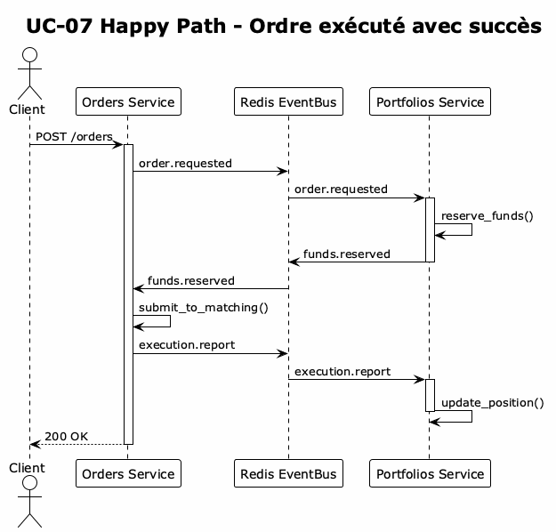
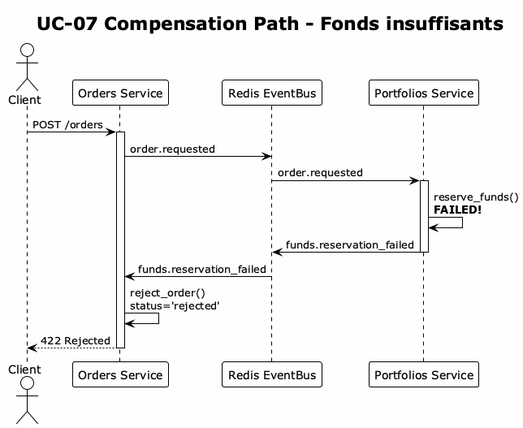
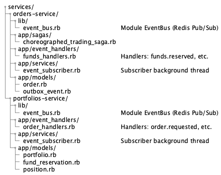

# UC-07 – Appariement d'ordres & Exécution (Saga Chorégraphiée)

> **Diagramme UML** : `docs/use_cases/assets/UC07/UC07_appariement_evenementiel.puml`

## Métadonnées

| Attribut | Valeur |
|----------|--------|
| **Identifiant** | UC-07 |
| **Version** | 2.0 (Saga Chorégraphiée) |
| **Statut** | Must-Have (Phase 3) |
| **Priorité** | Critique (cœur métier) |
| **Architecture** | Event-Driven avec Saga Chorégraphiée |

---

## Vue d'ensemble

L'UC-07 implémente le **cœur métier** de BrokerX : l'appariement des ordres d'achat et de vente. L'architecture utilise le pattern **Saga Chorégraphiée** avec une communication événementielle via **Redis Pub/Sub**.

### Qu'est-ce qu'une Saga Chorégraphiée ?

Une saga chorégraphiée est un pattern de gestion de transactions distribuées où :

- **Chaque service** publie des événements après avoir modifié son état
- **Les autres services** écoutent ces événements et réagissent en conséquence  
- **Pas de coordinateur central** - les services se coordonnent via les événements
- **Compensation** automatique via des événements de rollback si une étape échoue

### Comparaison : Orchestrée vs Chorégraphiée

| Aspect | Saga Orchestrée | Saga Chorégraphiée |
|--------|-----------------|-------------------|
| Coordination | Orchestrateur central | Décentralisée |
| Couplage | Services couplés à l'orchestrateur | Services indépendants |
| Point de défaillance | Orchestrateur = SPOF | Pas de SPOF |
| Complexité | Plus simple à comprendre | Plus complexe à tracer |
| Scalabilité | Limitée par l'orchestrateur | Très scalable |

---

## Objectif

Transformer la logique d'appariement des ordres en flux événementiel fiable permettant :
- L'extension vers une architecture microservices
- La cohérence forte via le pattern Outbox
- La résilience via compensation automatique
- La traçabilité complète via correlation IDs

---

## Architecture

### Diagramme d'architecture


### Flux détaillé des événements

#### Happy Path (Ordre exécuté avec succès)



#### Compensation Path (Fonds insuffisants)



---

## Acteurs

| Acteur | Rôle |
|--------|------|
| **Client** | Soumet un ordre via l'API |
| **Orders Service** | API REST, gestion des ordres, matching engine |
| **Portfolios Service** | Gestion des portefeuilles, réservation des fonds |
| **Redis EventBus** | Communication Pub/Sub entre services |
| **Outbox** | Table `outbox_events` pour garantir l'atomicité |
| **Matching Engine** | Appariement des ordres buy/sell |

---

## Types d'événements

| Événement | Source | Description | Payload |
|-----------|--------|-------------|---------|
| `order.requested` | Orders | Nouvel ordre créé, demande réservation fonds | `order_id`, `client_id`, `symbol`, `direction`, `quantity`, `price`, `estimated_cost` |
| `funds.reserved` | Portfolios | Fonds réservés avec succès | `order_id`, `portfolio_id`, `reserved_amount` |
| `funds.reservation_failed` | Portfolios | Échec réservation (fonds insuffisants) | `order_id`, `reason` |
| `order.placed` | Orders | Ordre accepté, soumis au matching | `order_id`, `status` |
| `order.cancelled` | Orders | Ordre annulé | `order_id`, `reason` |
| `execution.report` | Orders | Rapport d'exécution | `order_id`, `status`, `filled_quantity`, `fill_price`, `trade_id` |
| `trade.executed` | Orders | Trade créé | `trade_id`, `buyer_order_id`, `seller_order_id`, `quantity`, `price` |
| `funds.released` | Portfolios | Fonds libérés (annulation/compensation) | `order_id`, `released_amount`, `reason` |
| `position.updated` | Portfolios | Position mise à jour après trade | `portfolio_id`, `symbol`, `quantity`, `avg_price` |

### Structure d'un événement

```json
{
  "id": "550e8400-e29b-41d4-a716-446655440000",
  "type": "execution.report",
  "source": "orders-service",
  "correlation_id": "saga-123-abc",
  "timestamp": "2024-12-01T10:30:00.000Z",
  "data": {
    "order_id": "order-456",
    "client_id": "client-789",
    "status": "filled",
    "symbol": "AAPL",
    "quantity": 10,
    "price": 175.00,
    "trade_id": "trade-101"
  }
}
```

---

## Préconditions

- Ordre valide (voir UC-05) et portefeuille suffisant pour réservations
- Migration Outbox appliquée (`CreateOutboxEvents`)
- Services Orders et Portfolios démarrés
- Redis accessible pour EventBus
- Event subscribers actifs dans les deux services

---

## Postconditions

### Succès
- Ordre créé avec statut `pending_funds` → `new` → `working`/`filled`
- Événements publiés et traités par tous les services concernés
- Fonds réservés puis engagés (achat) ou position réduite (vente)
- Trade créé avec références aux ordres appariés
- Métriques mises à jour

### Échec
- Validation pré-trade échoue → aucun événement publié
- Fonds insuffisants → `funds.reservation_failed` → ordre rejeté
- Erreur technique → événement marqué `failed` (rejouable)

---

## Flux Principal

1. **Client** → `POST /api/v1/orders` avec payload ordre
2. **Orders Service** valide l'ordre, crée avec statut `pending_funds`
3. **Orders Service** publie `order.requested` via EventBus
4. **Portfolios Service** reçoit l'événement, vérifie les fonds
5. **Portfolios Service** réserve les fonds, publie `funds.reserved`
6. **Orders Service** reçoit `funds.reserved`, passe l'ordre à `new`
7. **Matching Engine** cherche contrepartie
   - **Aucune contrepartie** : ordre → `working`, publie `execution.report(working)`
   - **Contrepartie trouvée** : trade exécuté, ordres → `filled`, publie `execution.report(filled)`
8. **Portfolios Service** reçoit `execution.report`, met à jour les positions
9. **ActionCable** broadcast vers clients connectés

---

## Flux de Compensation

| Étape | Condition | Événement compensation | Résultat |
|-------|-----------|----------------------|----------|
| 4 | Fonds insuffisants | `funds.reservation_failed` | Ordre rejeté |
| 6 | Validation tardive échoue | `order.rejected` | Fonds libérés |
| 7 | Annulation par client | `order.cancelled` | `funds.released` |

---

## Critères d'Acceptation

### CA-07.01 – Ordre sans contrepartie
**Précondition** : Aucun ordre opposé même symbole  
**Action** : POST ordre limite ACHAT  
**Résultat** : Statut HTTP 200; ordre `pending_funds` → `new` → `working`; événement `execution.report(status=working)` présent

### CA-07.02 – Appariement deux ordres opposés
**Précondition** : ORDRE A (ACHAT) + ORDRE B (VENTE) quantité & symbole identiques, prix compatibles  
**Action** : POST second ordre  
**Résultat** : Deux ordres `filled`; deux trades; événements `execution.report(status=filled)`

### CA-07.03 – Fonds insuffisants
**Précondition** : Portefeuille avec solde insuffisant  
**Action** : POST ordre  
**Résultat** : `funds.reservation_failed` publié; ordre `rejected`

### CA-07.04 – Traçabilité correlation_id
**Action** : POST ordre avec `X-Correlation-Id`  
**Résultat** : Tous les événements de la saga portent le même `correlation_id`

---

## Exemple API

### Request
```http
POST /api/v1/orders
Authorization: Bearer <jwt>
X-Correlation-Id: 3ed1e2c8-6f5c-4d7f-9f6d-123456789abc
Content-Type: application/json

{
  "symbol": "AAPL",
  "order_type": "limit",
  "direction": "buy",
  "quantity": 10,
  "price": 100.0,
  "time_in_force": "DAY"
}
```

### Response 200
```json
{
  "id": "550e8400-e29b-41d4-a716-446655440000",
  "client_id": "client-789",
  "symbol": "AAPL",
  "direction": "buy",
  "order_type": "limit",
  "quantity": 10,
  "price": 100.0,
  "status": "pending_funds",
  "correlation_id": "3ed1e2c8-6f5c-4d7f-9f6d-123456789abc",
  "created_at": "2024-12-01T10:30:00.000Z"
}
```

---

## Avantages de l'architecture

### 1. Résilience
- Si Portfolios est down, les événements sont en queue Redis
- Quand il revient, il traite les événements en attente
- Pas de perte de transactions

### 2. Scalabilité
- Chaque service peut avoir plusieurs instances
- Redis distribue les événements
- Load balancing naturel

### 3. Découplage
- Orders ne connaît pas l'implémentation de Portfolios
- Les services communiquent uniquement via événements
- Facilite les tests et le déploiement indépendant

### 4. Traçabilité
- Chaque événement a un `correlation_id`
- Permet de suivre une transaction à travers tous les services
- Facilite le debugging en production

### 5. Audit Trail
- Tous les événements sont stockés dans Redis (sorted sets)
- Possibilité de replay pour debug ou recovery
- Historique complet des transactions

---

## Observabilité

### Métriques Prometheus

| Métrique | Type | Description |
|----------|------|-------------|
| `eventbus_events_published_total` | Counter | Événements publiés par type |
| `eventbus_events_processed_total` | Counter | Événements traités par type |
| `eventbus_events_failed_total` | Counter | Événements en échec |
| `eventbus_processing_duration_seconds` | Histogram | Temps de traitement |
| `outbox_events_pending` | Gauge | Événements en attente |
| `orders_enqueued_total` | Counter | Ordres soumis au matching |
| `orders_matched_total` | Counter | Ordres appariés |
| `trades_executed_total` | Counter | Trades exécutés |

### Logs
- Préfixes `[EventBus]`, `[MATCHING]`, `[OUTBOX]` pour corrélation
- `correlation_id` inclus dans tous les logs de la saga

---

## Fichiers d'implémentation



---

## Tests

### Tests d'intégration
```bash
# Exécuter les tests de la saga chorégraphiée
ruby test/integration/choreographed_saga_integration_test.rb

# Tests unitaires EventBus
ruby test/integration/eventbus_unit_test.rb
```

### Rake tasks
```bash
rake test:integration:saga      # Tests saga (nécessite Docker)
rake test:integration:eventbus  # Tests EventBus (nécessite Redis)
rake test:integration           # Tous les tests d'intégration
```

---

## Sécurité

- JWT obligatoire pour toutes les opérations
- Aucune donnée sensible dans les événements (limité aux champs publics)
- Validation des permissions à chaque étape de la saga
- Rate limiting sur l'API de création d'ordres

---

## Décisions d'Architecture

| Décision | Raison | Alternative considérée |
|----------|--------|----------------------|
| Redis Pub/Sub | Simplicité, performance, déjà présent | Kafka, RabbitMQ |
| Saga Chorégraphiée | Pas de SPOF, scalabilité | Saga Orchestrée |
| Outbox pattern | Atomicité ordre + événement | Publication directe |
| DB Redis 15 dédiée | Isolation EventBus | Même DB que cache |
| Correlation ID | Traçabilité distribuée | Logs agrégés |
